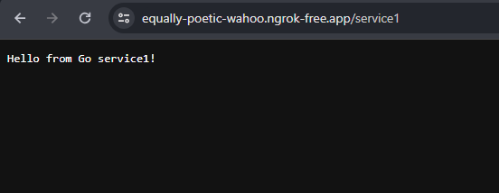
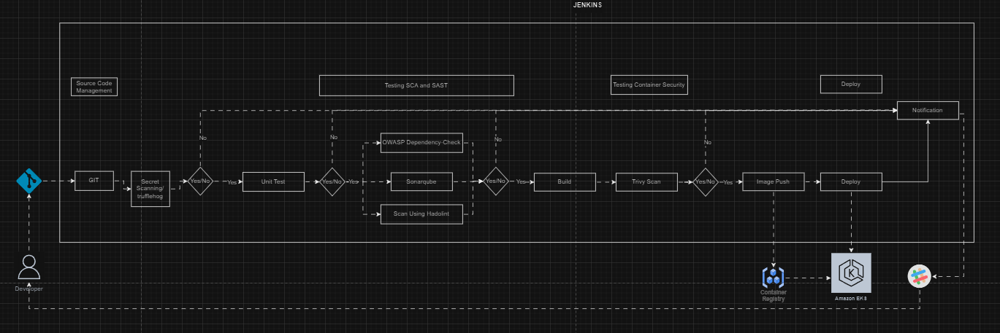

Pintu Demo

There are two simple services
1. Go service (service1)
2. Node.js service (service2)

Repo app and manifest (Github) : https://github.com/watri/my-monorepo
Image Registry (Docker-Hub) : https://hub.docker.com/repositories/watri
    - service1 - docker pull watri/service1
    - service2 - docker pull watri/service2
CI/CD using local Jenkins
Kubernetes using Docker-Desktop
Expose app to public internet using ngrok 

----------------------------------------------------------------
# Service1 

- Manifest location in deployment/service1/deployment.yaml
- app source code in dir service1/
- Dockerfile location in service1/Dockerfile
- Run the code using command "go run main.go" 
- Run the test using command "go test"
- CICD jenkins file is Jenkinsfile-service1
- Service URL : http://demo.127.0.0.1.nip.io/service1 

- Service URL expose using ngrok : https://equally-poetic-wahoo.ngrok-free.app/service1

----------------------------------------------------------------
# Service2 

- Manifest location in deployment/service2/deployment.yaml
- app source code in dir service2/
- Dockerfile location in service2/Dockerfile
- Run the code using command "node server.js" 
- Run the test using command "npm test"
- CICD jenkins file is Jenkinsfile-service2
- Service URL : http://demo.127.0.0.1.nip.io/service2 

- Service URL expose using ngrok : https://equally-poetic-wahoo.ngrok-free.app/service2

----------------------------------------------------------------
# CICD
Diagram

